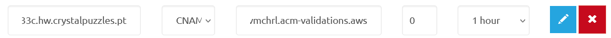

# Домашнее задание к занятию «Безопасность в облачных провайдерах»- Михалёв Сергей

### Подготовка к выполнению задания
Так как я фактически нахожусь в недружественной Европе, то сталкиваюсь с проблемой ограничения на использование платных ресурсов Yandex Cloud. Таким образом могу выполнить только второе задание с исполоьзованием ресурса Anazon AWS.

---
## Задание 2*. AWS (задание со звёздочкой)

Это необязательное задание. Его выполнение не влияет на получение зачёта по домашней работе.

**Что нужно сделать**

1. С помощью роли IAM записать файлы ЕС2 в S3-бакет:
 - создать роль в IAM для возможности записи в S3 бакет;
 - применить роль к ЕС2-инстансу;
 - с помощью bootstrap-скрипта записать в бакет файл веб-страницы.
2. Организация шифрования содержимого S3-бакета:

 - используя конфигурации, выполненные в домашнем задании из предыдущего занятия, добавить к созданному ранее бакету S3 возможность шифрования Server-Side, используя общий ключ;
 - включить шифрование SSE-S3 бакету S3 для шифрования всех вновь добавляемых объектов в этот бакет.

3. *Создание сертификата SSL и применение его к ALB:

 - создать сертификат с подтверждением по email;
 - сделать запись в Route53 на собственный поддомен, указав адрес LB;
 - применить к HTTPS-запросам на LB созданный ранее сертификат.

Resource Terraform:

- [IAM Role](https://registry.terraform.io/providers/hashicorp/aws/latest/docs/resources/iam_role).
- [AWS KMS](https://registry.terraform.io/providers/hashicorp/aws/latest/docs/resources/kms_key).
- [S3 encrypt with KMS key](https://registry.terraform.io/providers/hashicorp/aws/latest/docs/resources/s3_bucket_object#encrypting-with-kms-key).

Пример bootstrap-скрипта:

```
#!/bin/bash
yum install httpd -y
service httpd start
chkconfig httpd on
cd /var/www/html
echo "<html><h1>My cool web-server</h1></html>" > index.html
aws s3 mb s3://mysuperbacketname2021
aws s3 cp index.html s3://mysuperbacketname2021
```


**Решение**

1. Следуя структуре проекта из предыдущего задания создал новый модуль [*storage*](modules/storage/). В нём описал процесс создания S3 bucket.
Здесь для обеспечения доступа к ресурсу извне пришлось создать [*aws_s3_bucket_public_access_block*](https://registry.terraform.io/providers/hashicorp/aws/latest/docs/resources/s3_bucket_public_access_block) и [*aws_s3_bucket_policy*](https://registry.terraform.io/providers/hashicorp/aws/latest/docs/resources/s3_bucket_policy).</br>
Identy and Access Manager (IAM) AWS требует выдачи соответсвующего разрешения для пользовтаеля, от имени которого я поднимаю ресурсы:
```
{
  "Version": "2012-10-17",
  "Statement": [
    {
      "Effect": "Allow",
      "Action": [
        "s3:PutBucketAcl",
        "s3:GetBucketAcl"
      ],
      "Resource": "arn:aws:s3:::hw-smmikh-january-2025-store-bucket"
    }
  ]
}
```
Изображение [*cafe.jpg*](images/cafe.jpg) поместил в нутрь S3 через [*aws_s3_object*](https://registry.terraform.io/providers/hashicorp/aws/latest/docs/resources/s3_object). В итоге оно было доступно по ссылке *"https://hw-smmikh-january-2025-store-bucket.s3.amazonaws.com/cafe.jpg"*.</br>
</br> Ссылку я получил из [*outputs*](modules/storage/outputs.tf):</br>
</br>
Хранилище *hw-smmikh-january-2025-store-bucket* появилось в списке:</br>
</br>

2. Сделал [*Launch configurations*](modules/instances/main.tf) с использованием bootstrap-скрипта с созданием веб-страницы, на которой будет ссылка на картинку в S3. здесь я воспользовался *user_data*. Создал отдельный файл с шаблоном [*cloud-config*](modules/instances/user_data.yaml.tpl), куда передал переменную s3_image_url со ссылкой на S3:
```
user_data = templatefile("${path.module}/user_data.yaml.tpl", {
    s3_image_url = var.s3_image_url
  })
```

3. Написал [*aws_launch_configuration*](https://registry.terraform.io/providers/hashicorp/aws/latest/docs/resources/launch_configuration) создания одинаковых инстансов через [*Autoscaling Group*](https://registry.terraform.io/providers/hashicorp/aws/latest/docs/resources/autoscaling_group) и [*load balanser*](https://registry.terraform.io/providers/hashicorp/aws/latest/docs/resources/lb). для Загрузить три ЕС2-инстанса и настроить LB с помощью Autoscaling Group.

Ссылку на публичный ip *Autoscaling Group* я так же вывел в [outputs](modules/storage/outputs.tf):</br>
</br>

Скриншот обращения в браузере по DNS имени балансировщика нагрузки:</br>
</br>
Список запущенных виртуальных машие, видно использование двух зон:</br>
</br>
*Load Balanse*r:</br>
</br>
*Target Group* со списком инстансов и *Health Check* (все инстансы здоровы):</br>
</br>

