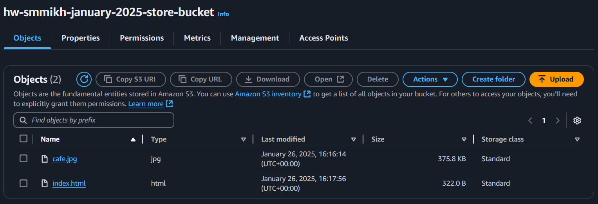

# Домашнее задание к занятию «Безопасность в облачных провайдерах»- Михалёв Сергей

### Подготовка к выполнению задания
Так как я фактически нахожусь в недружественной Европе, то сталкиваюсь с проблемой ограничения на использование платных ресурсов Yandex Cloud. Таким образом могу выполнить только второе задание с исполоьзованием ресурса Anazon AWS.

---
## Задание 2*. AWS (задание со звёздочкой)

Это необязательное задание. Его выполнение не влияет на получение зачёта по домашней работе.

**Что нужно сделать**

1. С помощью роли IAM записать файлы ЕС2 в S3-бакет:
 - создать роль в IAM для возможности записи в S3 бакет;
 - применить роль к ЕС2-инстансу;
 - с помощью bootstrap-скрипта записать в бакет файл веб-страницы.
2. Организация шифрования содержимого S3-бакета:

 - используя конфигурации, выполненные в домашнем задании из предыдущего занятия, добавить к созданному ранее бакету S3 возможность шифрования Server-Side, используя общий ключ;
 - включить шифрование SSE-S3 бакету S3 для шифрования всех вновь добавляемых объектов в этот бакет.

3. *Создание сертификата SSL и применение его к ALB:

 - создать сертификат с подтверждением по email;
 - сделать запись в Route53 на собственный поддомен, указав адрес LB;
 - применить к HTTPS-запросам на LB созданный ранее сертификат.

Resource Terraform:

- [IAM Role](https://registry.terraform.io/providers/hashicorp/aws/latest/docs/resources/iam_role).
- [AWS KMS](https://registry.terraform.io/providers/hashicorp/aws/latest/docs/resources/kms_key).
- [S3 encrypt with KMS key](https://registry.terraform.io/providers/hashicorp/aws/latest/docs/resources/s3_bucket_object#encrypting-with-kms-key).

Пример bootstrap-скрипта:

```
#!/bin/bash
yum install httpd -y
service httpd start
chkconfig httpd on
cd /var/www/html
echo "<html><h1>My cool web-server</h1></html>" > index.html
aws s3 mb s3://mysuperbacketname2021
aws s3 cp index.html s3://mysuperbacketname2021
```


**Решение**

1. С помощью роли IAM записать файлы ЕС2 в S3-бакет:
 - в рамках существующей структуры проекта сздал отдельный модуль [iam](modules/iam/) для работы с IAM AWS;
 - создал роль [*aws_iam_role*](https://registry.terraform.io/providers/hashicorp/aws/latest/docs/resources/iam_role) в IAM для возможности записи в S3 бакет;
  - создал полутику S3 для записи в бакет[*aws_iam_policy*](https://registry.terraform.io/providers/hashicorp/aws/latest/docs/resources/iam_policy)
 - написал [*aws_iam_role_policy_attachment*](https://registry.terraform.io/providers/hashicorp/aws/latest/docs/resources/iam_role_policy_attachment), связывающий политику с ролью.
 - применил роль к ЕС2-инстансу, а менно создал [*aws_iam_instance_profile*](https://registry.terraform.io/providers/hashicorp/aws/latest/docs/data-sources/iam_instance_profile) и добавил запись *iam_instance_profile* в описание инстанса;
 - для того, что бы всё это великолепие заработало, пришлось добавить море разрешений для текущего пользователя. Они касались как дополгительных разрешений для instance и bucket, так и просто разрешений для работы с разрешениями. Вот их список:
    -  *"iam:CreateRole",*
    -  *"iam:CreatePolicy",*
    -  *"iam:AttachRolePolicy",*
    -  *"iam:PassRole",*
    -  *"iam:ListRolePolicies",*
    -  *"iam:ListAttachedRolePolicies",*
    -  *"iam:GetPolicyVersion",*
    -  *"iam:ListPolicyVersions",*
    -  *"iam:ListInstanceProfilesForRole",*
    -  *"iam:CreateRole",*
    -  *"iam:DeletePolicy",*
    -  *"iam:DeleteRole",*
    -  *"iam:GetRole",*
    -  *"iam:DetachRolePolicy",*
    -  *"iam:RemoveRoleFromInstanceProfile",*
    -  *"iam:GetPolicy",*
    -  *"s3:CreateBucket",*
    -  *"s3:PutBucketAcl",*
    -  *"s3:GetBucketAcl",*
    -  *"s3:PutBucketPolicy",*
    -  *"s3:GetBucketPolicy",*
    -  *"s3:PutBucketPolicy",*
    -  *"s3:ListAllMyBuckets",*
    -  *"iam:CreateInstanceProfile",*
    -  *"iam:GetInstanceProfile",*
    -  *"iam:DeleteInstanceProfile",*
    -  *"iam:AddRoleToInstanceProfile"*

 - записал в бакет файл веб-страницы. Для этого внёс изменения в [user_data.yaml.tpl](modules\instances\user_data.yaml.tpl) файл.

 В результате к картинке *cafe.jpg* в хранилице добавился файл *index.html*</br>
 

2. Организация шифрования содержимого S3-бакета:

 - добавитл в [файле конфигурации S3](modules/storage/main.tf) добавил ресурс [*aws_s3_bucket_server_side_encryption_configuration*](https://registry.terraform.io/providers/hashicorp/aws/latest/docs/resources/s3_bucket_object#encrypting-with-kms-key) для автоматического шифрования всех новых объектов в бакете с использованием алгоритма AES256;
 - проверка настройки шифрования хранилища (*BucketKeyEnabled* не включаются автоматически, *false*):</br>  
 `aws s3api get-bucket-encryption --bucket hw-smmikh-january-2025-store-bucket`</br> и обьекта:</br> `aws s3api head-object --bucket hw-smmikh-january-2025-store-bucket --key cafe.jpg`</br>
 
 - включить шифрование SSE-S3 бакету S3 для шифрования всех вновь добавляемых объектов в этот бакет.

